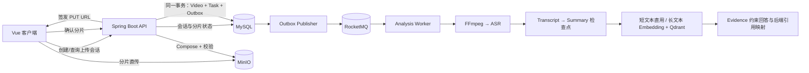

# VideoAgent

VideoAgent 是一个 Java 后端 + AI 视频理解应用。用户可以上传长视频，系统在后台完成音频提取、ASR、结构化总结和检索索引，并基于真实字幕证据回答问题、返回可追溯时间戳。

当前代码聚焦两条技术主线：

- **长视频上传与异步分析可靠性**：浏览器直传 MinIO、分片断点续传、幂等合并、事务 Outbox、任务租约/心跳、分阶段检查点和有界重试。
- **自适应 RAG 与可信证据**：短字幕直接使用完整上下文，长字幕分块并写入 Qdrant；检索严格隔离用户和视频，引用由后端从真实 Evidence 映射。

> 分片实现采用“临时分片对象 + MinIO Compose”，不是原生 S3 Multipart Upload。旧的 Spring multipart 上传接口仍保留兼容。

## 技术栈

- 后端：Java 21、Spring Boot 3、Maven、MyBatis-Plus、Flyway、LangChain4j
- 前端：Vue 3、TypeScript、Vite、Pinia、Vue Router、Axios、Element Plus
- 基础设施：MySQL 8、Redis、MinIO、Apache RocketMQ、Qdrant、Docker Compose
- 媒体与 AI：FFmpeg、可替换 ASR/LLM/Embedding Provider、确定性 Mock Provider
- 实时进度：Spring MVC `SseEmitter`、Browser `EventSource`、有限 GET fallback

## 整体链路



HTTP 完成接口只提交持久任务，不在请求线程中执行 FFmpeg、ASR、总结或向量化。

## 本地启动

### 1. 准备环境变量

```powershell
Copy-Item .env.example .env
```

修改 `.env` 中所有 `change-me-*` 值，并至少配置一个足够长的 `JWT_SECRET`。真实账号、密钥和 API Key 不得提交到仓库。示例基线见 `.env.example`，实际默认值见 `backend/src/main/resources/application.yml`。

默认使用 Mock ASR、Mock LLM、Mock Embedding 和 Mock Agent Planner，不需要第三方 API Key。

### 2. 启动基础设施

```powershell
docker compose up -d
docker compose ps
```

| 服务 | 默认地址/端口 |
| --- | --- |
| MySQL | `localhost:3306` |
| Redis | `localhost:6380` |
| MinIO API / Console | `http://localhost:9000` / `http://localhost:9001` |
| RocketMQ NameServer / Broker | `localhost:9876` / `localhost:10911` |
| Qdrant REST / gRPC | `localhost:6333` / `localhost:6334` |

Compose 为本地 `http://localhost:5173` 配置了 MinIO CORS。非本地环境必须把宿主机变量 `MINIO_CORS_ALLOW_ORIGIN` 改为真实前端 Origin；Compose 会把它传给容器内的 `MINIO_API_CORS_ALLOW_ORIGIN`，否则浏览器无法使用预签名 URL 直传。

### 3. 启动后端

需要 Java 21 或更高版本，以及可执行的 FFmpeg。FFmpeg 不在 `PATH` 时设置 `FFMPEG_PATH`：

```powershell
Set-Location backend
$env:FFMPEG_PATH = 'C:\path\to\ffmpeg.exe'
mvn spring-boot:run
```

健康检查：

```powershell
Invoke-RestMethod http://localhost:8080/api/health
```

Flyway 会自动执行 `V1`–`V9` 数据库迁移。

### 4. 启动前端

```powershell
Set-Location frontend
npm install
npm run dev
```

访问 `http://localhost:5173`。Vite 将 `/api` 代理到 `localhost:8080`。

## 长视频分片上传

### 上传协议

受保护接口均从 JWT 获取当前用户，并检查上传会话或视频 ownership：

```text
POST   /api/uploads
GET    /api/uploads/{uploadId}
POST   /api/uploads/{uploadId}/parts/{partNumber}/url
POST   /api/uploads/{uploadId}/parts/{partNumber}/complete
POST   /api/uploads/{uploadId}/complete
DELETE /api/uploads/{uploadId}
```

完整流程：

1. 客户端提交 `fileName`、`title`、`fileSize`、`contentType`、可选 `chunkSize` 和可选整文件 `sha256`。
2. 服务端校验 MP4、文件大小、分片大小和分片总数，自行生成正式 `objectKey` 与临时分片前缀；客户端不能指定存储路径。
3. 客户端为稳定的 `partNumber` 申请短时效预签名 URL，并直接 `PUT` 到 MinIO。视频字节不经过 Spring Boot。
4. 客户端确认分片后，服务端从 MinIO 读取实际大小和 ETag，再幂等写入 MySQL。
5. 页面刷新或网络恢复后，客户端查询会话，只补传响应中缺失的分片。前端默认最多 3 个并发请求，支持暂停、继续、取消、进度显示和带抖动的有限重试。
6. 完成时服务端锁定会话，重新检查所有分片，用 MinIO Compose 生成确定性的正式对象，并校验最终大小、MP4 `ftyp` 头；请求提供整文件 SHA-256 时还会校验摘要。
7. 同一数据库事务中创建唯一视频、唯一分析任务和待发送 Outbox 事件。并发或重复完成请求返回同一结果，不会重复建视频或任务。

上传会话状态：

```text
CREATED → UPLOADING → COMPLETING → COMPLETED
                         └──────→ FAILED（可重试完成）
CREATED / UPLOADING / FAILED → CANCELLED 或 EXPIRED
```

定时清理任务只删除过期、取消或已完成会话的临时分片，不删除 `COMPLETED` 会话对应的正式视频对象。

默认限制：

| 配置 | 默认值 | 说明 |
| --- | ---: | --- |
| `VIDEO_RESUMABLE_MAX_FILE_SIZE` | `20GB` | 新分片直传入口的文件上限 |
| `VIDEO_UPLOAD_DEFAULT_CHUNK_SIZE` | `16MB` | 默认分片大小 |
| `VIDEO_UPLOAD_MIN_CHUNK_SIZE` / `VIDEO_UPLOAD_MAX_CHUNK_SIZE` | `5MB` / `128MB` | 允许的分片范围 |
| `VIDEO_UPLOAD_MAX_PARTS` | `10000` | 最大分片数 |
| `VIDEO_UPLOAD_SESSION_TTL` | `24h` | 会话有效期 |
| `VIDEO_UPLOAD_PRESIGN_TTL` | `15m` | 单个直传 URL 有效期 |
| `VIDEO_UPLOAD_MAX_CONCURRENCY` | `3` | 服务端返回给客户端的并发上限 |

旧接口 `POST /api/videos` 仍接受 Spring multipart MP4，默认受 `VIDEO_MAX_FILE_SIZE=500MB` 和 `VIDEO_MAX_REQUEST_SIZE=501MB` 限制。长视频应使用 `/api/uploads`，它绕过 Spring 请求体大小限制。

### 为什么使用 MinIO Compose

项目现有 MinIO Java SDK 已能完成预签名 PUT、对象状态查询和服务端 Compose，因此没有为“技术名词”额外引入 AWS S3 SDK：

- 浏览器直接上传，避免 Spring Boot 中转大文件和占用应用带宽/堆外缓冲。
- 每个临时分片都是可查询、可校验的对象，MySQL 可持久恢复上传进度。
- Compose 在 MinIO 内部完成，不需要应用下载后再拼接。
- 使用源对象 ETag 条件避免合并期间分片被悄悄替换。

代价是临时对象数量更多，需要清理任务；该方案也不能描述为原生 S3 Multipart Upload。

## 可靠异步分析

### 持久化衔接与状态机

`video`、`analysis_task` 和 `analysis_outbox_event` 在同一个 MySQL 事务中保存。Outbox Publisher 独立重试消息发送，避免数据库已提交但 RocketMQ 消息丢失。

分析任务沿用现有兼容状态名：

```text
PENDING → PROCESSING → SUCCESS
              └────→ RETRY_WAITING → PROCESSING
              └────→ FAILED
```

`analysis_task` 记录当前阶段、尝试次数、最近错误码/错误信息、失败阶段、下次重试时间、处理时间和 `processing_generation`。

### 重复消息、Worker 抢占与旧 Worker 隔离

- RocketMQ 可能重复投递；Consumer 通过数据库条件更新抢占任务，已经完成或不满足状态条件的消息直接跳过。
- Worker 只为当前 JVM 真正持有的任务续租。租约过期后，恢复任务可以把任务重新放回可执行状态。
- 每次成功抢占都会递增 `processing_generation`。可以把它理解为一张带编号的工作票：之后所有心跳、进度和终态更新都必须携带同一编号。新 Worker 接管后编号已变化，旧 Worker 即使恢复，也无法覆盖新 Worker 的状态。
- 单次任务默认最长执行 `2h`，处理租约默认 `15m`，心跳默认每 `2m` 续租；不会无限占用任务。
- Redis 和 SSE 只提供进度缓存/观察通道，失败不会改变业务终态；MySQL 始终是事实源。

### 第三方 API 失败路径

1. Provider 将网络错误、超时、HTTP `408/425/429` 和可恢复 `5xx` 分类为可重试错误。
2. 参数错误、认证失败、无权限等确定性 `4xx` 直接失败，不做无效重试。
3. 可重试错误进入 `RETRY_WAITING`，默认总尝试次数最多 3 次；退避从 5 秒开始指数增长，最多 60 秒并加入随机抖动。
4. REST Provider 响应包含 `Retry-After` 时优先使用服务端建议，但等待上限为 15 分钟。
5. 超出任务尝试次数或最大执行时间后进入 `FAILED`，保留最近错误和失败阶段。

Transcript 和 Summary 是持久化检查点：

- ASR 成功、总结失败：重试时从 Summary 继续，不重复调用 ASR。
- Summary 成功、向量化失败：重试时从 RAG Index 继续，不重复调用 ASR 或 LLM 总结。
- RAG 构建使用独立 `build_token` 和构建租约，旧构建者不能覆盖新构建者结果。

连接/读取超时分别由 Provider 配置控制，例如 `ASR_TIMEOUT`、`LLM_TIMEOUT`、`EMBEDDING_TIMEOUT`；整体任务受 `ANALYSIS_MAX_EXECUTION_TIME` 约束。

## 自适应 RAG 与可信引用

```text
POST /api/videos/{videoId}/qa
POST /api/videos/{videoId}/qa/agentic
GET  /api/videos/{videoId}/rag/status
POST /api/videos/{videoId}/rag/index
```

- **短 Transcript**：字符数不超过 `RAG_DIRECT_CONTEXT_MAX_CHARS`（默认 8000）时使用完整上下文，不切块、不调用 Embedding，索引状态为 `NOT_REQUIRED`。
- **长 Transcript**：按字幕片段边界分块，保留 `startMs`、`endMs`、`videoId`、`userId` 元数据，写入 Qdrant 后执行 Top-K 语义检索。
- **隔离**：所有向量写入和搜索都绑定 `userId + videoId`，API 层也再次检查视频 ownership。
- **Agentic Retrieval**：Planner 只能选择 `GET_VIDEO_SUMMARY`、`GET_TRANSCRIPT_BY_TIME`、`SEARCH_TRANSCRIPT`；后端限制时间窗口、参数范围、Evidence 数量/长度和最大工具调用次数。
- **可信 Citation**：模型只返回 Evidence 序号，后端再映射为真实字幕/检索块的时间范围；越界或伪造序号会被丢弃。
- **证据不足**：语义命中低于 `RAG_MINIMUM_SCORE`（默认 0.45），或回答无法映射到真实引用时，返回“根据当前视频内容无法确定。”。

默认 `RAG_TOP_K=5`、`RAG_CHUNK_MAX_CHARS=2000`、相邻块重叠 1 个字幕片段。生产环境应根据实际语料评测后调参，不能把这些默认值当作性能结论。

## 主要 API

除注册、登录和健康检查外，业务 API 均需要 Bearer JWT。

```text
POST /api/auth/register
POST /api/auth/login
GET  /api/auth/me

POST   /api/videos                         兼容的普通 multipart 上传
GET    /api/videos
GET    /api/videos/{videoId}
DELETE /api/videos/{videoId}

POST /api/videos/{videoId}/analysis
GET  /api/analysis/{taskId}
GET  /api/analysis/{taskId}/events         text/event-stream

GET /api/videos/{videoId}/transcript
GET /api/videos/{videoId}/summary
GET /api/videos/{videoId}/chapters
GET /api/videos/{videoId}/key-points
```

## 数据库结构

Flyway 迁移位于 `backend/src/main/resources/db/migration`。主要表：

| 表 | 职责 |
| --- | --- |
| `app_user`、`video` | 用户与有 ownership 的正式视频 |
| `video_upload_session`、`video_upload_part` | 可恢复上传会话、分片大小/ETag/摘要和完成结果 |
| `analysis_task` | 分析状态、阶段、重试、租约和 generation |
| `analysis_outbox_event` | 待发送/重试的 RocketMQ 事件 |
| `video_transcript_segment` | 带开始/结束时间的 ASR 检查点 |
| `video_summary`、`video_chapter`、`video_key_point` | 结构化总结检查点 |
| `video_rag_index` | RAG 模式、构建状态、租约和 build token |

Qdrant 保存长 Transcript 的向量与证据元数据，不替代 MySQL 中的业务状态。

## 构建与测试

常规验证：

```powershell
Set-Location backend
mvn test
mvn package

Set-Location ../frontend
npm run build
```

需要 Docker 基础设施的测试默认跳过，显式启用方式如下：

```powershell
Set-Location backend

$env:VIDEOAGENT_UPLOAD_INFRA_TEST = 'true'
mvn '-Dtest=ResumableUploadInfrastructureIntegrationTest' test

$env:VIDEOAGENT_M7_INFRA_TEST = 'true'
mvn '-Dtest=Milestone7ReliabilityInfrastructureIntegrationTest' test

$env:VIDEOAGENT_M8_RAG_INFRA_TEST = 'true'
mvn '-Dtest=Milestone8RagInfrastructureIntegrationTest' test

$env:VIDEOAGENT_M8_AGENT_INFRA_TEST = 'true'
mvn '-Dtest=Milestone8AgentInfrastructureIntegrationTest' test
```

最近一次实际验证结果：

| 验证 | 真实结果 |
| --- | --- |
| 后端 `mvn test` | 308 tests，0 failures，0 errors，33 skipped（带开关的基础设施/真实 AI 测试） |
| 分片上传基础设施测试 | 1/1 通过；覆盖预签名直传、重复确认、缺片恢复、并发/重复完成、SHA-256、单一视频/任务和跨用户拒绝 |
| M7 可靠性基础设施测试 | 9/9 通过；覆盖事务 Outbox、重复消息、检查点恢复、过期租约接管、generation 隔离和重试预算 |
| M8 RAG 基础设施测试 | 2/2 通过；覆盖短/长上下文、Qdrant 过滤和后端 Citation 映射 |
| 前端 `npm run build` | 构建成功；Vite 仅提示主 chunk 较大 |

没有执行过真实 20GB 文件的压力/性能测试，也没有执行需要付费凭据的真实 ASR、LLM 和 Embedding 端到端 Smoke Test；README 不声明相关性能数据。

## 目录结构

```text
backend/
  src/main/java/com/videoagent/
    auth/        JWT 登录与当前用户
    upload/      分片会话、直传确认、Compose、清理
    video/       正式视频元数据与兼容上传接口
    storage/     MinIO 存储适配与 Compose
    analysis/    异步任务、MQ、租约/心跳、恢复与 SSE
    outbox/      事务 Outbox 发布
    media/       FFmpeg 与受控临时目录
    asr/         ASR Provider
    summary/     结构化总结 Provider 与检查点
    transcript/  时间戳字幕
    rag/         分块、Embedding、Qdrant、QA 与 Citation
    agent/       白名单检索工具与 Planner
    provider/    第三方 HTTP 错误分类
  src/main/resources/db/migration/  Flyway V1-V9
frontend/        Vue 3 Web 应用与可恢复上传客户端
infra/           RocketMQ 本地配置
docker-compose.yml
```

## 已知限制

- 当前只接受 MP4；完成阶段校验容器头，但不做完整媒体解码验证。
- 前端刷新后受浏览器文件权限限制，需要用户重新选择同一个本地文件，随后会自动查询会话并只补传缺失分片。
- 前端当前不计算整文件 SHA-256；服务端始终校验分片 ETag、大小、最终大小和 MP4 头，调用方提供 SHA-256 时才做整文件摘要校验。
- MinIO Compose 依赖临时分片对象；生产部署必须监控清理任务并正确配置 CORS、生命周期和存储容量。
- LangChain4j LLM 适配器能按异常/状态分类重试；如果 SDK 异常不暴露响应头，则无法读取该次 LLM 响应的 `Retry-After`。REST ASR/Embedding 适配器支持该响应头。
- 默认 Provider 都是 Mock。真实模型质量、限流配额、成本和最大输入需要按供应商单独验证。
- SSE 订阅者保存在当前应用进程；多实例部署若要跨实例实时推送，需要额外的广播方案。Redis 仍只用作临时进度缓存。
- 前端尚未提供视频播放器与点击 Citation 跳转播放功能；后端已返回真实时间范围。
- 已完成正确性测试，但未进行大文件并发压测、故障注入压测或性能基准测试。

历史分期计划见 [IMPLEMENTATION_PLAN.md](./IMPLEMENTATION_PLAN.md)，当前能力以代码、Flyway 迁移和测试结果为准。
