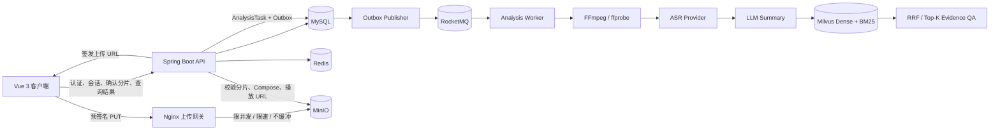

# VideoAgent

VideoAgent 是一个面向长视频的智能分析与问答系统。用户上传 MP4 视频后，系统异步完成音频提取、ASR 字幕生成、结构化总结和检索索引构建，并基于真实字幕证据回答问题、返回可跳转的时间范围。

项目采用 Vue 3 + Spring Boot 模块化单体。MySQL 保存业务事实，MinIO 保存视频与临时分片，RocketMQ 传递异步分析消息，Redis 提供上传进度、限流、任务进度和会话缓存，Milvus 统一承载长字幕的 Dense 与 BM25 派生索引。

> 当前实现只支持 MP4。长视频上传使用“临时分片对象 + MinIO Compose”，不是原生 S3 Multipart Upload。

## 目录

- [核心能力](#核心能力)
- [系统架构](#系统架构)
- [技术栈](#技术栈)
- [快速开始](#快速开始)
- [主要业务链路](#主要业务链路)
- [AI Provider 配置](#ai-provider-配置)
- [主要 API](#主要-api)
- [数据库与迁移](#数据库与迁移)
- [测试与验证](#测试与验证)
- [项目结构](#项目结构)
- [已知边界](#已知边界)

## 核心能力

- **可恢复分片上传**：浏览器 Web Worker 计算整文件 SHA-256，分片经预签名 PUT 直传 MinIO，支持暂停、恢复、取消、缺片补传和幂等完成。
- **上传硬限流**：独立 Nginx 上传网关承接预签名 PUT，请求不回流 Spring Boot；限流键只对 PUT 生效，支持单 IP 并发、全局并发、请求速率和 burst 限制，拒绝状态为 HTTP 429。
- **并发幂等**：同一用户、同一 SHA-256 同时创建上传会话时，由 MySQL 生成列和唯一索引选出唯一活跃 Session；竞争失败方复用 winner 的 `uploadId`。
- **可靠异步分析**：分析任务与 Transactional Outbox 同事务提交，RocketMQ 重复投递通过数据库条件更新、租约、心跳和 generation fencing 隔离。
- **阶段级 Checkpoint**：字幕、总结和 RAG 索引分别持久化；重试从最近成功阶段继续，避免无条件重复调用 ASR 或 LLM。
- **统一 RAG 索引**：所有有效字幕都按字幕边界切块，并建立 Milvus Dense 与 BM25 索引。
- **混合检索**：Dense Retrieval 与 Milvus BM25 分别召回，应用层执行 RRF，截取最终 Top-K Evidence。
- **证据约束问答**：检索始终绑定服务端确定的 `userId + videoId`；模型只返回请求内 Evidence ID，最终时间戳由后端映射真实字幕证据。
- **紧凑视频工作区**：桌面端播放器与 AI Q&A 在左栏纵向排列并保持 `24px` 间距，右侧内容面板独立展示；小屏继续使用现有单列响应式布局。
- **多轮会话记忆**：MySQL 保存持久会话，Redis 缓存最近历史；Redis 不可用时回退 MySQL。

## 系统架构



MySQL 是任务、字幕、总结、视频归属、上传状态和 RAG 生命周期的事实源。Redis、Milvus 和 MinIO 中可重建或临时的数据不替代数据库状态机。

## 技术栈

| 层级 | 技术 |
| --- | --- |
| 后端 | Java 21、Spring Boot 3.5.5、Maven、Spring Security、MyBatis-Plus、Flyway |
| AI | LangChain4j 1.18.0、可替换 ASR / LLM / Embedding Provider |
| 前端 | Vue 3、TypeScript、Vite 6、Pinia、Vue Router、Axios、Element Plus |
| 基础设施 | MySQL 8、Redis、MinIO、Nginx、RocketMQ、Milvus 2.6.22、etcd、Docker Compose |
| 媒体处理 | FFmpeg、ffprobe |
| 实时进度 | Spring MVC `SseEmitter`、浏览器 SSE 流读取及有限 GET fallback |

## 快速开始

### 1. 环境要求

- Docker Desktop，且 Docker Engine 已启动
- Java 21 或更高版本
- Maven 3.9 或可用的 Maven 安装
- Node.js 18 或更高版本、npm
- 同时包含 `ffmpeg` 和 `ffprobe` 的 FFmpeg 发行版

### 2. 准备环境变量

在项目根目录复制示例文件：

```powershell
Copy-Item .env.example .env
```

Linux/macOS：

```bash
cp .env.example .env
```

至少需要处理以下配置：

| 配置 | 说明 |
| --- | --- |
| `MYSQL_ROOT_PASSWORD` | MySQL 初始化密码 |
| `MYSQL_USER` / `MYSQL_PASSWORD` | 后端数据库账号 |
| `MINIO_ACCESS_KEY` / `MINIO_SECRET_KEY` | MinIO 账号 |
| `JWT_SECRET` | JWT 密钥，必须至少包含 32 个 UTF-8 字节 |
| `EMBEDDING_API_KEY` | `.env.example` 默认启用 DashScope Embedding，因此完整 Demo 需要填写 |

禁止提交真实密码或 API Key。完整变量和示例值见 [.env.example](.env.example)，应用默认值见 [application.yml](backend/src/main/resources/application.yml)。Spring Boot 会加载根目录或 `backend` 上级目录中的 `.env`。

如果只需要无第三方付费调用的本地流程，将以下配置改为 Mock：

```env
ASR_PROVIDER=mock
LLM_PROVIDER=mock
EMBEDDING_PROVIDER=mock
AGENT_PLANNER_PROVIDER=mock
```

### 3. 启动基础设施

```powershell
docker compose up -d
docker compose ps
```

| 服务 | 默认地址 | 用途 |
| --- | --- | --- |
| MySQL | `localhost:3306` | 业务数据与 Flyway 迁移 |
| Redis | `localhost:6380` | Bitmap、令牌桶、进度和会话缓存 |
| MinIO API | `http://localhost:9000` | 本地对象存储 |
| MinIO Console | `http://localhost:9001` | MinIO 管理界面 |
| Upload Gateway | `http://localhost:9002` | 浏览器预签名 PUT 入口 |
| RocketMQ NameServer | `localhost:9876` | MQ 服务发现 |
| RocketMQ Broker | `localhost:10911` | 分析消息传递 |
| Milvus | `localhost:19530` | Dense + BM25 检索 |
| Milvus WebUI/HTTP | `http://localhost:9091` | 健康检查与管理入口 |

Milvus 使用独立的 `milvus-etcd` 和 `milvus-minio` 容器保存自身元数据与对象数据，它们不对宿主机暴露业务端口。

### 4. 启动后端

```powershell
Set-Location backend
mvn spring-boot:run
```

如果 FFmpeg 不在 `PATH`：

```powershell
$env:FFMPEG_PATH = 'C:\path\to\ffmpeg.exe'
$env:FFPROBE_PATH = 'C:\path\to\ffprobe.exe'
mvn spring-boot:run
```

后端默认地址为 `http://localhost:8080`，启动时 Flyway 自动执行 `V1` 至 `V16`。健康检查：

```powershell
Invoke-RestMethod http://localhost:8080/api/health
Invoke-RestMethod http://localhost:8080/actuator/health
```

### 5. 启动前端

```powershell
Set-Location frontend
npm ci
npm run dev
```

访问 `http://localhost:5173`。Vite 将 `/api` 代理到 `http://localhost:8080`。

Windows 用户也可以在准备好 `.env` 后运行：

```powershell
.\start-dev.bat
```

脚本会检查 Java、Maven、Node.js、npm、Docker 和所需基础设施，并分别启动前后端窗口。

## 主要业务链路

### 可恢复分片上传

```text
计算整文件 SHA-256
  → 创建或复用 Upload Session
  → 申请分片预签名 URL
  → 浏览器经 Nginx PUT 到 MinIO
  → 后端校验实际分片大小与 ETag
  → MySQL 记账 + Redis Bitmap 加速进度查询
  → MinIO Compose
  → 创建或复用 canonical Video
```

上传控制面由 Spring Boot 处理，视频字节通过上传网关直接进入 MinIO。Nginx 配置了：

- `proxy_request_buffering off` 和 `proxy_buffering off`；
- 单 IP 最大并发 `6`；
- 全局最大并发 `100`；
- 单 IP 默认请求速率 `20r/s`、burst `40`；
- 超限统一返回 HTTP 429。

客户端默认使用 `16MB` 分片和最多 `3` 个并发上传请求。上传状态为：

```text
CREATED → UPLOADING → COMPLETING → COMPLETED
                         └──────→ FAILED
CREATED / UPLOADING / FAILED → CANCELLED 或 EXPIRED
```

同一用户、同一 SHA-256 最多存在一个 `CREATED / UPLOADING / FAILED / COMPLETING` Session。`COMPLETED / CANCELLED / EXPIRED` 不占用活跃唯一键，因此不阻止创建新 Session。

`expectedSha256` 由浏览器计算，目前用于用户范围内的视频去重和上传会话幂等。服务端会验证分片存在性、大小、ETag、合并后总大小和 MP4 `ftyp` 头，但不会重新流式计算最终对象的标准整文件 SHA-256。准确的信任边界见 [docs/sha256-trust-model.md](docs/sha256-trust-model.md)。

### 异步分析与可靠性

上传完成只创建或复用 Video。用户显式调用分析接口后，系统才创建 `analysis_task` 和 `analysis_outbox_event`，HTTP 请求线程不会同步执行 FFmpeg、ASR、总结或向量化。

```text
PENDING → PROCESSING → SUCCESS
              ├────→ RETRY_WAITING → PROCESSING
              └────→ FAILED
```

- Transactional Outbox 解决 MySQL 状态与 RocketMQ 投递之间的可靠衔接。
- Consumer 通过条件更新抢占任务；重复消息不会重复取得同一代执行资格。
- `processing_generation`、租约和心跳阻止旧 Worker 覆盖新 Worker 状态。
- ASR、Summary 和 RAG Index 是独立 Checkpoint；只有已经持久化成功的阶段才能在重试时复用。
- 第三方临时错误按有限预算重试；确定性认证、参数和响应结构错误不会无限重试。
- Redis 分析令牌桶默认容量为 `60`，每秒补充 `10` 个令牌，每次分析请求消耗 `1` 个；单用户默认最多有 `3` 个活跃分析任务。
- Redis 限流故障采用 fail-open，后续仍由 MySQL 任务幂等与活动任务数检查保护，但不等价于严格的分布式成本配额。

### RAG 索引与混合检索

视频分析完成后，所有有效字幕都以带时间戳的 ASR 字幕片段作为最小不可拆单元，使用本地 Token 估算器按目标 Token Budget 动态合并相邻字幕片段；默认目标约 `600` Token，相邻 Chunk 重叠一个字幕片段。这里的 Chunk Token 数是本地启发式估算值，不声明与托管 `text-embedding-v4` Tokenizer 完全一致。`600` 是控制检索粒度的工程默认值，并非该 Embedding 模型的 `8192` Token 输入上限。索引状态按 `NOT_BUILT → BUILDING → READY/FAILED` 推进，问答只在索引为 `READY` 时执行检索。

Milvus Collection 同时保存：

- `denseVector`：Embedding 生成的浮点向量，使用 COSINE 检索；
- `text`：启用 `jieba` tokenizer、`lowercase` 和 `cnalphanumonly` filter；
- `sparseVector`：由 Milvus BM25 Function 从 `text` 生成；
- `userId`、`videoId`、`analysisTaskId`、时间范围和源字幕索引。

每次查询执行：

```text
Query Embedding → Dense Top-K ┐
                              ├→ RRF → 最终 Top-K Evidence
Query Text      → BM25 Top-K  ┘
```

Dense 和 BM25 都强制过滤 `userId + videoId`。重建同一视频时先严格删除旧 Chunk，再写入确定性 Chunk ID；只有 Milvus 写入成功且当前 `buildToken` 仍有效，MySQL 中的索引状态才会变为 `READY`。

默认分块与检索参数：

| 配置 | 默认值 |
| --- | ---: |
| `RAG_CHUNK_TARGET_TOKENS` | `600` |
| `RAG_CHUNK_OVERLAP_SEGMENTS` | `1` |
| `RAG_DENSE_TOP_K` | `15` |
| `RAG_DENSE_MINIMUM_SCORE` | `0.0` |
| `RAG_LEXICAL_TOP_K` | `15` |
| `RAG_RRF_K` | `60` |
| `RAG_FINAL_EVIDENCE_LIMIT` | `5` |

这些值是工程默认值，不代表已经针对生产语料完成效果或容量调优。

## AI Provider 配置

| 能力 | Provider | 启用真实服务时的关键配置 |
| --- | --- | --- |
| ASR | `mock`、`groq`、`dashscope` | `ASR_PROVIDER`、`ASR_API_KEY`；模型和地址有 Provider 默认值 |
| Summary / QA | `mock`、`openai` | `LLM_PROVIDER=openai`、`LLM_API_KEY`、`LLM_MODEL`；兼容服务另配 `LLM_BASE_URL` |
| Embedding | `mock`、`openai`、`dashscope` | `EMBEDDING_PROVIDER`、`EMBEDDING_API_KEY`、`EMBEDDING_BASE_URL`、`EMBEDDING_MODEL`、正确的 `EMBEDDING_DIMENSION` |
| Agent Planner | `mock`、`llm` | `AGENT_PLANNER_PROVIDER=llm`，并提供完整 LLM 配置 |

显式选择真实 Provider 但缺少必要配置时，应用会启动失败，不会静默降级为 Mock。Embedding 维度必须与 Milvus Collection Schema 一致；修改模型维度后需要使用匹配的 Collection 或重建派生索引。

## 主要 API

除注册、登录和健康检查外，业务接口均要求 `Authorization: Bearer <JWT>`。

### 认证与健康检查

```text
POST /api/auth/register
POST /api/auth/login
GET  /api/auth/me
GET  /api/health
GET  /actuator/health
```

### 视频与上传

```text
POST   /api/videos                         兼容的 Spring multipart 上传
GET    /api/videos
GET    /api/videos/{videoId}
GET    /api/videos/{videoId}/playback-url
PATCH  /api/videos/{videoId}
DELETE /api/videos/{videoId}

POST   /api/uploads
GET    /api/uploads/{uploadId}
POST   /api/uploads/{uploadId}/parts/{partNumber}/url
POST   /api/uploads/{uploadId}/parts/{partNumber}/complete
POST   /api/uploads/{uploadId}/complete
DELETE /api/uploads/{uploadId}
```

### 分析结果与问答

```text
GET  /api/videos/{videoId}/analysis
POST /api/videos/{videoId}/analysis
GET  /api/analysis/{taskId}
GET  /api/analysis/{taskId}/events

GET  /api/videos/{videoId}/transcript
GET  /api/videos/{videoId}/summary
GET  /api/videos/{videoId}/chapters
GET  /api/videos/{videoId}/key-points

GET  /api/videos/{videoId}/rag/status
POST /api/videos/{videoId}/rag/index
POST /api/videos/{videoId}/qa
POST /api/videos/{videoId}/qa/agentic
```

## 数据库与迁移

Flyway 脚本位于 `backend/src/main/resources/db/migration`，当前范围为 `V1`–`V16`。

| 表 | 职责 |
| --- | --- |
| `app_user`、`video` | 用户、视频归属和用户范围内的内容去重 |
| `video_upload_session`、`video_upload_part` | 上传状态机、分片记账、完成 fencing 和并发幂等 |
| `analysis_task` | 分析阶段、状态、重试、租约、错误和 generation |
| `analysis_outbox_event` | 待发布和重试的 RocketMQ 事件 |
| `video_transcript_segment` | 带时间戳的 ASR 字幕 Checkpoint |
| `video_summary`、`video_chapter`、`video_key_point` | 结构化总结 Checkpoint |
| `video_rag_index` | RAG 构建状态、租约和 build token |
| `conversation_turn` | 按用户和视频隔离的持久对话历史 |

最新迁移：

- `V15`：将历史 RAG 索引重置为 `NOT_BUILT`，清空旧构建信息，并删除已经不再使用的 MySQL `video_rag_chunk` 表。
- `V16`：先把重复活跃上传 Session 标记为 `EXPIRED`，再创建 STORED 生成列 `active_expected_sha256` 和唯一索引 `uk_video_upload_active_hash`。
- `V17`：将历史 `NOT_REQUIRED` 索引状态迁移为 `NOT_BUILT`，并删除已废弃的 `context_mode`、`transcript_chars` 字段。

Milvus 是可以从 MySQL 字幕重新构建的派生检索索引，不参与 Flyway 事务。升级后，处于 `NOT_BUILT` 状态且已有有效字幕的视频可以通过现有 RAG 建索引入口重建。

## 测试与验证

完整常规回归：

```powershell
Set-Location backend
mvn test

Set-Location ../frontend
npm test
npm run build

Set-Location ..
docker compose config --quiet
git diff --check
```

需要真实基础设施的用例默认通过环境变量门控，不会在普通 `mvn test` 中伪装成 Mock 验收。常用真实验收命令：

```powershell
Set-Location backend

$env:VIDEOAGENT_UPLOAD_INFRA_TEST = 'true'
mvn '-Dtest=ResumableUploadInfrastructureIntegrationTest' test

$env:VIDEOAGENT_ANALYSIS_PROTECTION_INFRA_TEST = 'true'
mvn '-Dtest=AnalysisProtectionInfrastructureIntegrationTest' test

$env:VIDEOAGENT_REAL_MILVUS_ACCEPTANCE = 'true'
mvn '-Dtest=RealMilvusInfrastructureAcceptanceTest' test

$env:VIDEOAGENT_HYBRID_RAG_INFRA_TEST = 'true'
mvn '-Dtest=HybridRagInfrastructureIntegrationTest' test

$env:VIDEOAGENT_M8_RAG_INFRA_TEST = 'true'
mvn '-Dtest=Milestone8RagInfrastructureIntegrationTest' test

$env:VIDEOAGENT_M8_AGENT_INFRA_TEST = 'true'
mvn '-Dtest=Milestone8AgentInfrastructureIntegrationTest' test

$env:VIDEOAGENT_M7_INFRA_TEST = 'true'
mvn '-Dtest=Milestone7ReliabilityInfrastructureIntegrationTest,M7TransactionalAtomicityIntegrationTest' test
```

真实 ASR、LLM 与 Embedding Smoke Test 需要额外显式开关、有效凭据和测试视频。它们可能产生第三方费用，默认不执行。

如需观测本地 Token 估算器与 DashScope `text-embedding-v4` 实际用量的偏差，可在提供有效 `EMBEDDING_API_KEY` 后显式运行开发级校准测试：

```powershell
$env:VIDEOAGENT_TOKEN_ESTIMATION_CALIBRATION_TEST = 'true'
mvn '-Dtest=DashScopeTokenEstimationCalibrationIntegrationTest' test
```

该测试逐条读取响应中的 `usage.total_tokens` 并输出估算比值；它不属于生产分块链路，也不要求本地估算值与托管模型 Tokenizer 完全相等。

## 项目结构

```text
backend/
  src/main/java/com/videoagent/
    auth/        JWT 认证与当前用户
    video/       视频元数据、播放 URL 与兼容上传
    upload/      分片 Session、直传确认、Compose、幂等和清理
    storage/     MinIO 内部、播放和上传预签名客户端
    analysis/    任务状态机、MQ Consumer、租约、恢复和 SSE
    outbox/      Transactional Outbox 发布
    media/       FFmpeg 与临时文件管理
    asr/         ASR Provider
    summary/     结构化总结 Provider
    transcript/  时间戳字幕
    rag/         分块、Embedding、Milvus、BM25、RRF 和 QA
    agent/       受约束 Planner、白名单工具、Evidence 与会话记忆
  src/main/resources/
    application.yml
    db/migration/          Flyway V1-V17
frontend/                  Vue 3 客户端、上传 Worker 和页面测试
infra/nginx/               上传网关配置模板
infra/rocketmq/            RocketMQ Broker 配置
docs/                      设计边界与补充文档
scripts/start-dev.ps1      Windows 本地启动脚本
docker-compose.yml
```

## 已知边界

- 当前只接受 MP4；完成阶段校验文件大小和 `ftyp` 头，不进行完整媒体解码验证。
- 客户端 SHA-256 是去重与幂等标识，不是服务端重新计算后的可信内容证明。
- MinIO Compose、MySQL 状态和 Redis Bitmap 不在同一个分布式事务中；系统通过 fencing、幂等和恢复任务实现最终收敛。
- Milvus 写入与 MySQL `READY` 状态不是跨存储原子事务；失败会保留可重建状态，不能描述为分布式事务。
- Nginx 只能限制经过上传网关的 PUT。开发环境允许客户端直连 `MinIO:9000` 便于调试；生产环境必须通过网络策略禁止客户端直接访问 MinIO 原始 API 端口，否则可绕过上传限流。
- Redis 令牌桶故障时采用 fail-open；单用户活动任务数检查是一层实用保护，不应表述为严格原子配额。
- SSE 订阅者保存在当前应用实例；多实例部署如需跨实例实时推送，需要额外广播机制。
- 真实 Provider 的模型质量、配额、成本和最大输入必须针对供应商单独验证。
- 项目未声明未经执行的大文件并发性能、弱网成功率、召回率或生产容量数据。

当前行为以源码、Flyway 迁移和可重复执行的测试结果为准。
